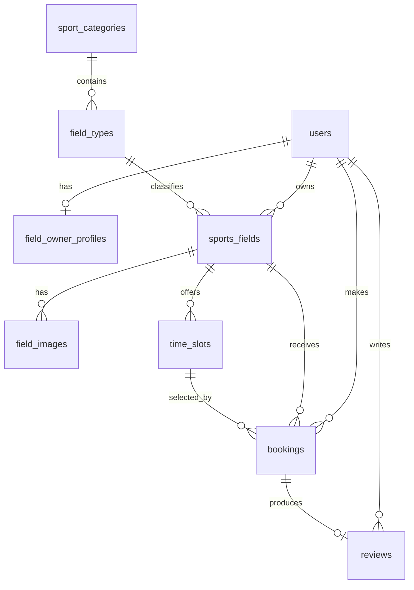

# Bối cảnh dự án cho AI — Tây Vương / SportHub

- Cập nhật lần cuối: **2026-09-07 15:59**
- Trạng thái: Laravel REST API và React SPA đã tách riêng, chạy local với Laragon MySQL.
- Nguồn: mã nguồn hiện tại, đề cương người dùng cung cấp, `REFERENCES.md` và `History/2026-09-01_2032_chuyen-api-react-layered.md`.

## 1. Mục tiêu sản phẩm

SportHub là nền tảng tiếng Việt kết nối khách cần thuê sân với chủ sân thể thao. Khách tìm sân, xem lịch trống, gửi booking và đánh giá. Chủ sân quản lý sân và xử lý booking. Admin kiểm duyệt chủ sân/sân, quản lý danh mục, tài khoản và nội dung.

Chưa có thanh toán online thật, thông báo email/SMS, bản đồ, xóa/quản lý riêng từng ảnh, tùy chỉnh slot bằng UI hoặc CRUD sửa/xóa category/type.

## 2. Kiến trúc hiện tại

Dự án không còn là Laravel MVC/Blade. Đây là hai ứng dụng trong một repository:

```text
Browser
  -> React 19 + TypeScript + Vite (frontend/, port 5173)
  -> Axios / TanStack Query / React Router
  -> Laravel Sanctum SPA cookie + CSRF
  -> Laravel REST API (/api/v1, port 8011)
  -> Middleware -> FormRequest -> Controller -> DTO -> Service
  -> Eloquent Model -> MySQL
  -> API Resource -> JSON -> React
```

Ánh xạ với N-Layer của Spring Boot/.NET Core:

| Khái niệm | Vị trí Laravel |
| --- | --- |
| Controller | `app/Http/Controllers/Api/V1/` |
| Request/validation | `app/Http/Requests/Api/` |
| DTO | `app/DTOs/` |
| Response DTO/serializer | `app/Http/Resources/Api/` |
| Service/business | `app/Services/` |
| Entity/repository ORM | `app/Models/` và Eloquent query trong service |
| Enum | `app/Enums/` |
| Exception/global handler | `app/Exceptions/`, `bootstrap/app.php` |
| Security | Sanctum, `app/Http/Middleware/EnsureUser*.php` |
| Config | `config/*.php` |

Không tạo lớp `Entity` song song với `Models` hoặc repository hình thức vì Eloquent model đã đảm nhiệm entity + persistence theo convention Laravel. Controller chỉ điều phối; nghiệp vụ nằm trong service.

## 3. Công nghệ và lệnh chạy

| Tầng | Công nghệ |
| --- | --- |
| Backend | PHP `^8.3`, Laravel 13, Sanctum 4, Eloquent |
| Frontend | React 19, TypeScript 6, Vite 8, React Router 8, TanStack Query 5, Axios, Lucide |
| Database | MySQL/Laragon khi chạy; SQLite in-memory khi test |
| Auth | Session cookie `web` qua Sanctum SPA, CSRF, role và active middleware |
| Test | PHPUnit/Laravel feature tests; TypeScript/Vite build; Oxlint |

Chạy cả hai server bằng `npm run dev`, hoặc chạy riêng:

```powershell
php artisan serve --port=8011
npm --prefix frontend run dev
```

Frontend: `http://127.0.0.1:5173`; backend: `http://127.0.0.1:8011`; API: `/api/v1`.

## 4. Cấu trúc mã nguồn

```text
app/
  DTOs/{Auth,Booking,Field,Profile}/
  Enums/
  Exceptions/
  Http/
    Controllers/Api/V1/{Customer,FieldOwner,Admin}/
    Middleware/
    Requests/Api/
    Resources/Api/
  Models/
  Services/
bootstrap/app.php                 # route, middleware alias, JSON exception handler
config/{cors,frontend,sanctum}.php
database/{migrations,seeders}/
frontend/
  src/{api,components,context,layouts,pages,types}/
routes/api.php                    # metadata /api và 40 endpoint REST v1
tests/Feature/Api/                # auth/role/booking/API tests
Doc/                              # local-only, bị .gitignore loại khỏi Git
ProjectLog/PROJECT_LOG.md          # log trạng thái/cách chạy local, Markdown bị ignore
```

Toàn bộ controller Blade, view Blade, thư mục `resources/`, bundle `public/build`, Laravel Vite config, `routes/web.php` và middleware role cũ đã bị loại vì React/API đã thay thế. Backend metadata nằm tại `/api`; `/up` là health check.

## 5. Vai trò và luồng nghiệp vụ

### Customer

1. Đăng ký/đăng nhập, lấy thông tin `/auth/me`, đăng xuất.
2. Xem trang chủ, lọc sân theo từ khóa/danh mục/loại/giá và xem chi tiết.
3. Chọn ngày để gọi available-slots; chỉ sân `approved` + active mới được đặt.
4. Service xác minh slot active và thuộc đúng sân, khóa transaction và chặn slot đã có booking `pending`/`confirmed`.
5. Booking mới là `pending`, giá hiện bằng `price_per_hour × 1.5`.
6. Có thể hủy booking đủ điều kiện; booking `completed` được review tối đa một lần.

### Field owner

1. Hồ sơ đăng ký chủ sân bắt đầu `pending`.
2. Dashboard, danh sách sân, booking, review và hồ sơ riêng.
3. Tạo/sửa/bật tắt sân; service kiểm ownership. Sân mới `pending`, tạo 8 slot mặc định.
4. Chuyển booking theo trạng thái hợp lệ: `pending -> confirmed/rejected/cancelled`, `confirmed -> completed/cancelled`.

### Admin

1. Dashboard số liệu toàn hệ thống.
2. Khóa/mở customer/field owner; không khóa admin.
3. Duyệt/từ chối hồ sơ chủ sân và sân.
4. Xem booking; ẩn/hiện review; thêm category và field type.

## 6. API

Tất cả endpoint ở `/api/v1`; chi tiết request/response nằm trong `Doc/API_CONTRACT.md` và `routes/api.php`.

| Nhóm | Endpoint chính | Bảo vệ |
| --- | --- | --- |
| Auth | `/auth/login`, `/register`, `/me`, `/logout` | guest hoặc `auth:sanctum` |
| Public | `/home`, `/categories`, `/field-types`, `/fields`, `/fields/{slug}`, available-slots | public |
| Customer | `/customer/bookings`, `/reviews`, `/profile` | auth + active + role customer |
| Owner | `/field-owner/dashboard`, `/fields`, `/bookings`, `/reviews`, `/profile` | auth + active + role field_owner |
| Admin | `/admin/dashboard`, `/users`, `/field-owners`, `/fields`, `/bookings`, `/reviews`, `/categories`, `/field-types` | auth + active + role admin |

Response thành công dùng `data`; danh sách phân trang dùng `data`, `links`, `meta`. Lỗi validation trả 422 với `message` và `errors`; chưa đăng nhập 401; sai role/ownership 403; xung đột nghiệp vụ 409.

## 7. Dữ liệu

Schema nghiệp vụ không đổi:



Sanctum bổ sung bảng `personal_access_tokens`, dù SPA hiện dùng cookie session chứ không phát token cho frontend first-party.

## 8. Frontend

- Public layout: trang chủ, danh sách/lọc sân, chi tiết, đăng nhập/đăng ký.
- Customer workspace: booking/review/profile/password.
- Owner workspace: dashboard/sân/booking/review/profile.
- Admin workspace: dashboard/user/chủ sân/sân/booking/review/category.
- `ProtectedRoute` kiểm auth và role; `AuthContext` giữ session user; TanStack Query quản lý server state; Axios tự gửi cookie và XSRF.
- Vite dev proxy `/api`, `/sanctum`, `/storage` sang Laravel port 8011.
- Metadata Open Graph/X dùng ảnh thương hiệu `frontend/public/og.png`; favicon dùng màu xanh rừng/lime của SportHub.

## 9. Bảo mật và giới hạn cần nhớ

- Không ghi `.env`, token, mật khẩu thật hoặc dữ liệu cá nhân vào tài liệu/log commit.
- `.gitignore` chặn `.env`, mọi biến thể `.env.*`/`*.env`, certificate private, `Doc/` ở cả dạng viết hoa/thường và các tệp `*.md`; chỉ whitelist file mẫu `*.env.example` và `/README.md` ở thư mục gốc. README gốc được Git theo dõi để hiển thị trên GitHub; tài liệu AI/History vẫn chỉ giữ trên máy.
- SPA phải gọi `/sanctum/csrf-cookie` trước request thay đổi auth/data.
- `SANCTUM_STATEFUL_DOMAINS` phải chứa host frontend kèm port khi chạy khác origin.
- Endpoint available-slots chỉ trả dữ liệu cho sân đã duyệt và đang hoạt động.
- Chặn double booking hiện ở transaction + lock ứng dụng, chưa có unique constraint phù hợp vì trạng thái booking thay đổi.
- Commit `cd1da60` đã thêm middleware `owner.approved` cho API vận hành của chủ sân, nhưng implementation đang đọc nhầm `$profile->verified` thay vì `$profile->verification_status`; hiện cả owner approved có thể bị chặn. Hai route profile vẫn truy cập được. Route logout vẫn còn nằm trong nhóm `active`, nên tài khoản bị khóa chưa đăng xuất sạch được.
- Ảnh nằm trong public storage, cần `php artisan storage:link`.
- Xóa/tạo lại dữ liệu bằng `migrate:fresh --seed` là destructive; chỉ dùng trên database phát triển.

## 10. Kiểm thử hiện tại

- 13 test, 32 assertion chạy đạt trên SQLite in-memory; bộ test hiện chưa bao phủ owner pending/approved hoặc logout của tài khoản bị khóa nên chưa phát hiện hai lỗi auth trong commit `cd1da60`.
- Bao phủ backend entrypoint/health, public catalog, session login, 401, tài khoản inactive, role/ownership 403, bảo vệ admin, tạo booking hợp lệ, chặn slot thuộc sân khác và chặn xem slot của sân chưa duyệt.
- Build React/TypeScript và Oxlint đều chạy sạch.
- Smoke test thật qua Vite proxy + Laravel ngày `2026-09-01` đã đạt cho đăng nhập và endpoint riêng của customer, owner, admin. Ngày `2026-09-02`, health và frontend/ảnh preview trả 200; API cần dữ liệu chưa smoke lại do Laragon/MySQL đang tắt. Sau audit, metadata backend được chuyển từ `/` sang `/api`.
- Audit tàn dư MVC ngày `2026-09-02`: 0 file Blade, không còn `resources/`, `routes/web.php` hoặc `public/build`; 111 file PHP nguồn kiểm tra cú pháp đều đạt.

## 11. Giao thức tài liệu

Trước mọi phân tích/đề xuất/sửa mã: đọc tệp này và `Doc/README.md`, tạo history mới từ template, ghi nguồn vào history và `REFERENCES.md`. Sau thay đổi, cập nhật tài liệu này nếu lỗi thời. `Doc/` bị ignore khỏi Git theo yêu cầu người dùng.
