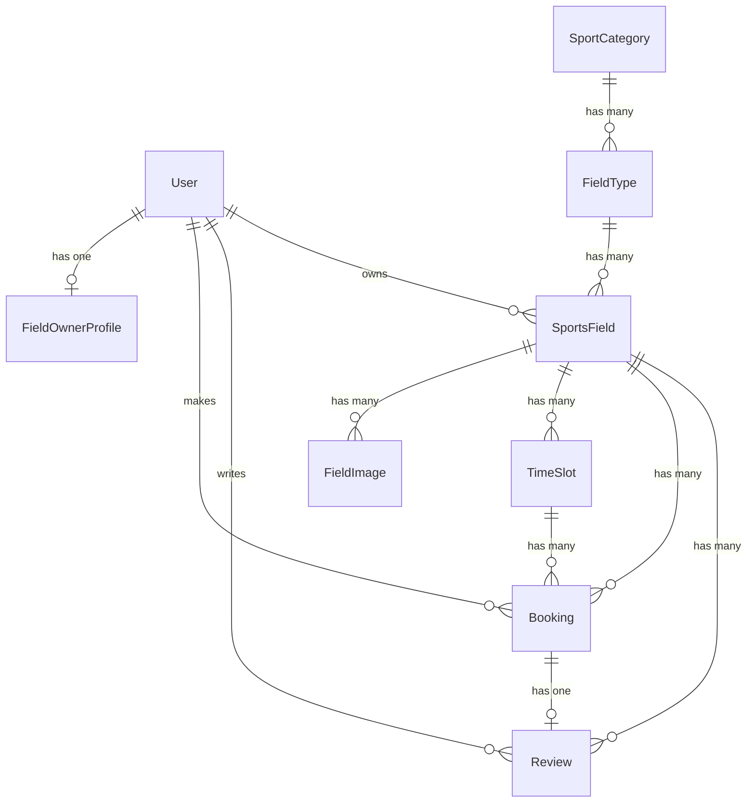

# ⚽ Website Quản Lý và Đặt Sân Thể Thao Trực Tuyến (SportHub)

Hệ thống trung gian kết nối khách hàng có nhu cầu thể thao với các chủ sân bóng đá, cầu lông, tennis, bóng chuyền, bóng rổ. Hỗ trợ tìm kiếm, kiểm tra khung giờ còn trống realtime không cần tải lại trang (AJAX), đặt sân, theo dõi đơn hàng và quản lý doanh thu.

---

## 📌 Các Nhóm Người Dùng & Chức Năng Chính

### 1. ⚽ Khách Hàng (Customer / User)
- **Tài khoản**: Đăng ký, đăng nhập, quên/đổi mật khẩu, xem và cập nhật hồ sơ cá nhân, đổi ảnh đại diện.
- **Tìm kiếm & Lọc**: Tìm sân theo tên/địa chỉ, lọc theo danh mục thể thao (Bóng đá, Cầu lông, Tennis, Bóng rổ, Bóng chuyền), lọc theo loại sân, khoảng giá thuê.
- **Kiểm tra khung giờ realtime (AJAX)**: Chọn ngày để xem các khung giờ còn trống trực tiếp mà không cần reload trang.
- **Đặt sân & Thanh toán**: Xác nhận thông tin, xem tổng số tiền và gửi yêu cầu đặt sân.
- **Lịch sử & Đánh giá**: Theo dõi trạng thái đơn hàng (Chờ xác nhận, Đã xác nhận, Đã hoàn thành, Đã hủy/Từ chối), hủy đơn khi đủ điều kiện, đánh giá số sao (1-5⭐) và viết bình luận sau khi sử dụng sân.

### 2. 🏢 Chủ Sân (Field Owner)
- **Quản lý sân bóng**: Đăng bài sân mới, cập nhật thông tin sân, ngừng/bật hoạt động sân, upload nhiều hình ảnh sân bóng.
- **Quản lý giá & Khung giờ**: Cấu hình giá thuê theo giờ và các khung giờ hoạt động.
- **Quản lý đơn đặt**: Xem lịch đặt sân, xác nhận hoặc từ chối đơn đặt, đánh dấu hoàn thành sau khi khách sử dụng.
- **Thống kê doanh thu**: Theo dõi tổng số sân, tổng lượt đặt, lượt đặt theo ngày/tháng, doanh thu theo ngày/tháng, thống kê sân hot nhất.

### 3. 👑 Quản Trị Viên (System Admin)
- **Quản lý tài khoản**: Khóa / mở khóa tài khoản Khách hàng và Chủ sân.
- **Kiểm duyệt chủ sân**: Duyệt hoặc từ chối hồ sơ đăng ký tài khoản chủ sân.
- **Kiểm duyệt sân bóng**: Duyệt sân bóng do chủ sân đăng trước khi hiển thị công khai trên hệ thống.
- **Quản lý danh mục**: Thêm/sửa danh mục thể thao và loại sân.
- **Báo cáo & Giám sát**: Thống kê toàn bộ số liệu hệ thống (doanh thu, đơn hàng, người dùng), giám sát và ẩn các đánh giá/bình luận vi phạm.

---

## 🛠️ Công Nghệ Sử Dụng

- **Backend**: Laravel 13.x, PHP 8.2+ / 8.3+
- **Database**: MySQL / SQLite (Eloquent ORM, Migrations, Seeders)
- **Frontend**: Blade Template, Tailwind CSS v4, JavaScript (ES6+, Fetch API AJAX)
- **Phân quyền**: Role-based Middleware (`admin`, `field_owner`, `customer`)

---

## 🗄️ Sơ Đồ Quan Hệ Dữ Liệu (ERD)



---

## ⚙️ Hướng Dẫn Cài Đặt Dự Án (Installation Guide)

### 1. Yêu cầu hệ thống
- PHP >= 8.2 (đã bật các extension: `pdo`, `mbstring`, `openssl`, `sqlite3` hoặc `mysqli`)
- Composer >= 2.x
- Node.js & NPM (tùy chọn nếu build assets)

### 2. Cài đặt các bước

```bash
# 1. Clone repository
git clone https://github.com/KhangNG2603/tayvuongpj.git
cd tayvuongpj

# 2. Cài đặt thư viện PHP
composer install

# 3. Tạo file môi trường .env
cp .env.example .env

# 4. Tạo Application Key
php artisan key:generate

# 5. Tạo file database SQLite (hoặc cấu hình MySQL trong file .env)
touch database/database.sqlite

# 6. Chạy Migration và Seed dữ liệu mẫu
php artisan migrate:fresh --seed

# 7. Tạo Symbolic Link cho Storage (để xem ảnh upload)
php artisan storage:link
```

---

## 🌐 Cấu Hình Tên Miền Local `http://tayvuong.com`

### Cách 1: Sử dụng FlyEnv (Recommeded trên Linux)
1. Mở ứng dụng **FlyEnv**.
2. Thêm hoặc Sửa Site:
   - **Domain**: `tayvuong.com`
   - **Path (Đường dẫn)**: Trỏ chính xác vào thư mục **`public`** của dự án:
     `/path/to/tayvuongpj/public`
3. Lưu cấu hình và truy cập: **`http://tayvuong.com`**

### Cách 2: Sử dụng Artisan Serve
1. Thêm domain vào `/etc/hosts`:
   ```bash
   echo "127.0.0.1 tayvuong.com" | sudo tee -a /etc/hosts
   ```
2. Chạy lệnh:
   ```bash
   php artisan serve --port=8000
   ```
3. Truy cập: **`http://localhost:8000`** hoặc **`http://tayvuong.com:8000`**

---

## 🔑 Tài Khoản Mẫu Để Kiểm Thử (Dữ Liệu Seeded)

Tất cả tài khoản mẫu có mật khẩu chung là: **`password`**

| Vai trò | Email đăng nhập | Mật khẩu | Chức năng kiểm thử |
|---|---|---|---|
| **System Admin** | `admin@sportfield.com` | `password` | Truy cập `/admin/dashboard` - Duyệt sân, duyệt chủ sân, khóa user, xem báo cáo |
| **Field Owner (Chủ sân 1)** | `owner1@sportfield.com` | `password` | Truy cập `/field-owner/dashboard` - Đăng sân, xác nhận đơn đặt, thống kê |
| **Field Owner (Chủ sân 2)** | `owner2@sportfield.com` | `password` | Quản lý hệ thống sân Sao Mai Arena |
| **Customer (Khách hàng 1)** | `customer@sportfield.com` | `password` | Tìm sân, chọn ngày & slot AJAX, đặt sân, xem lịch sử, đánh giá sân |
| **Customer (Khách hàng 2)** | `customer2@sportfield.com` | `password` | Tài khoản khách hàng mẫu thứ 2 |

---

## 🧪 Chạy Kiểm Thử Tự Động (Automated Testing)

Dự án tích hợp sẵn bộ kiểm thử tính năng (Feature Tests) với PHPUnit / Laravel Test:

```bash
php artisan test
```

---

## 📜 Giấy Phép (License)

Dự án đồ án học thuật mở rộng phát triển trên nền tảng Laravel Framework ([MIT License](https://opensource.org/licenses/MIT)).
